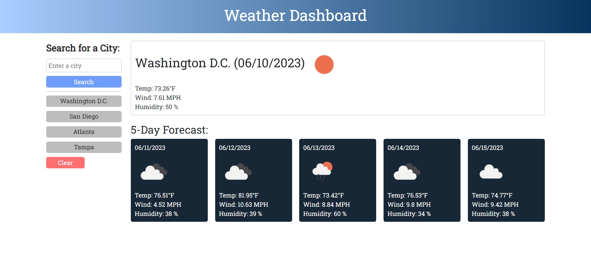

# Weather Dashboard

## Description
* A browser ran weather dashboard that displays the forecast for various cities with a quick search.
* Users are able to click back through their previously searched cities to pull up the current and 5-day forecast for that city.
* Weather Dashboard is perfect for planning trips around the weather.
## Installation
1. Run Weather Dashboard either through the deployed [GitHub Page](https://averyjmiller.github.io/weather-dashboard/) or on your local machine. *Note: If you are choosing to run the application on your local machine, you must run it with a live server.*

## Usage
1. Enter a valid city in the input and click the search button.
2. Observe the current forecast for that location as well as the predicted 5-day forecast.
3. Search for more cities and click back through previously searched cities.
---

## Credits
**APIs**
* [OpenWeather](https://openweathermap.org/)
* [Bootstrap v5.3.0](https://getbootstrap.com/)
* [Google Fonts](https://fonts.google.com/)
## License
Please refer to the `LICENSE` in the repo.